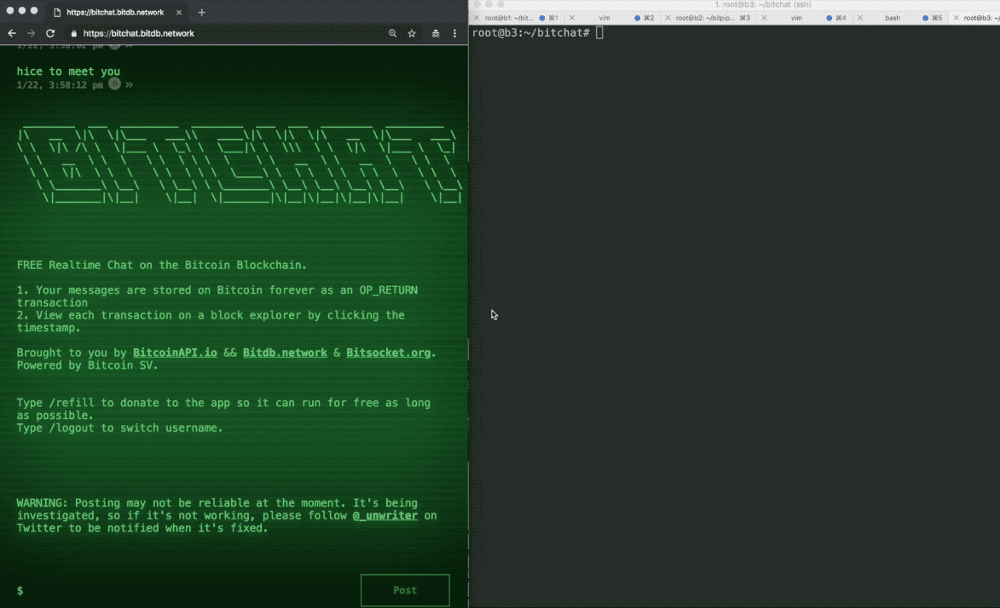
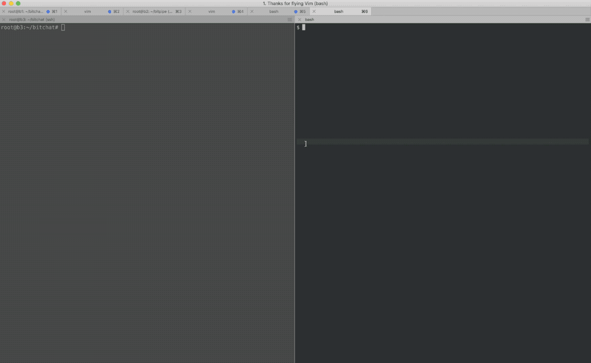

# Bitchat

> Realtime chat over Bitcoin.



Powered by:

1. **[Bitdb](https://bitdb.network):** For reading OP_RETURN messages from Bitcoin SV
2. **[Bitsocket](https://www.bitsocket.org):** For subscribing to OP_RETURN messages from Bitcoin SV
3. **[Bitpipe](https://github.com/unwriter/bitpipe#2-light-node):** A Bitpipe Light node For broadcasting transactions.

Uses the Bitcoin SV blockchain.

# Key Management

This package includes key management by default.

When you run `npm start`, it will ask you for a private key.

This will be stored in a private `.env` file and used for sessions to send transactions.

Unlike the web version, this terminal version uses YOUR KEY to send transactions.

# How to Use

## Step 1. Download the code

```
git clone https://github.com/unwriter/bitchat.git
```

(or just download the [zip file](https://github.com/unwriter/bitchat/archive/master.zip))

## Step 2. Run

Open your terminal and go to the bitchat folder. Then run:

```
npm start
```

And that's it!

It will ask you to enter your WIF private key the first time, which will be stored LOCALLY in your `.env` file (it's a hidden file).

# See in Action

## 1. Terminal to Browser

You can send from terminal to browser


## 2. Terminal to Terminal

Bitchat terminal edition ships with native push notification for its parent OS. So you'll get a push notification when there's a new message.



## 3. Browser to Terminal

Too lazy to do a demo for this one. But it works.

---

# Internal

Internally it's powered by a [Bitpipe Light node](https://github.com/unwriter/bitpipe#2-light-node), which lets you post to Bitcoin even withoout a Bitcoin node.

Which means, anyone can run this.
